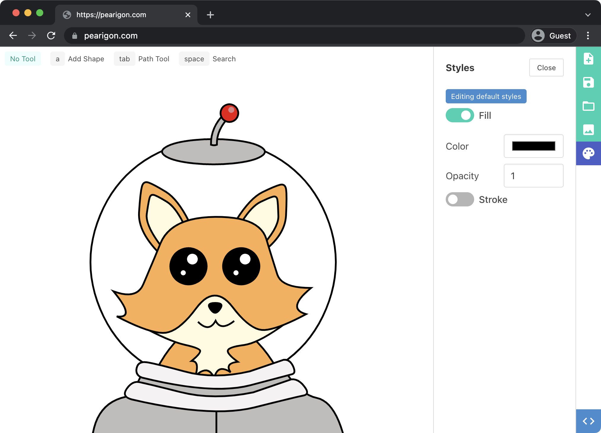
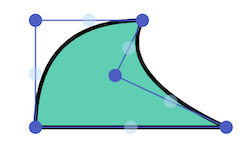
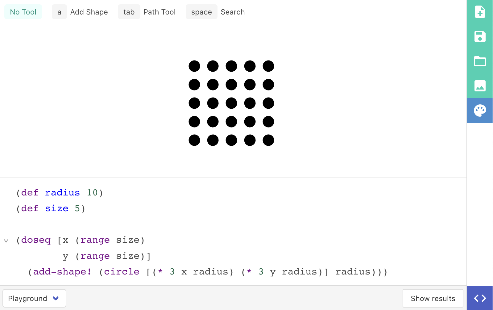

| <strong>⚠️ WARNING:</strong> This app is a work in progress! Many features are still being developed. Lots of optimization is needed.|
|---|


<p align="center">
    
</p>

# Pearigon
> Minimal UI. Hotkey Driven. Hackable.

## Features

### Hotkey suggestions

Context sensitive hotkey suggestions are displayed at the top of the screen.
I hope this will make the tool more accessible.

<p align="center">
    
</p>

### Search

Pressing `Space` will open the search panel. Like the hotkey suggestions,
only relevant actions are displayed.

### Path editing

The path editor is simple but effective. Paths are composed of points that
can be either sharp or round.

New points can be inserted by clicking the pale blue dot between points.

<p align="center">
    
</p>

### REPL driven (write code to build shapes)

At any time a Clojure REPL can be opened to write code that manipulates
the project. In the future, this will also enable users to create custom
shapes and tools.

The live execution is powered by @borkdude's amazing project [Sci](https://github.com/babashka/sci).
The editor itself is CodeMirror with [Clojure Mode](https://github.com/nextjournal/clojure-mode)
by the lovely folks at NextJournal.

<p align="center">
    
</p>

### SVG Export

Export your project as an SVG so it can be used in all your favorite tools!

## Local Development

You will need to have the following installed:
* Babashka
* Node
* Clojure CLI

```
npm install
bb dev
```

This will run a live dev (on port 3000) and test (on port 8021) server.

#### Emacs

Once running, use `cider-connect-cljs` to jack in. Happy hacking!
